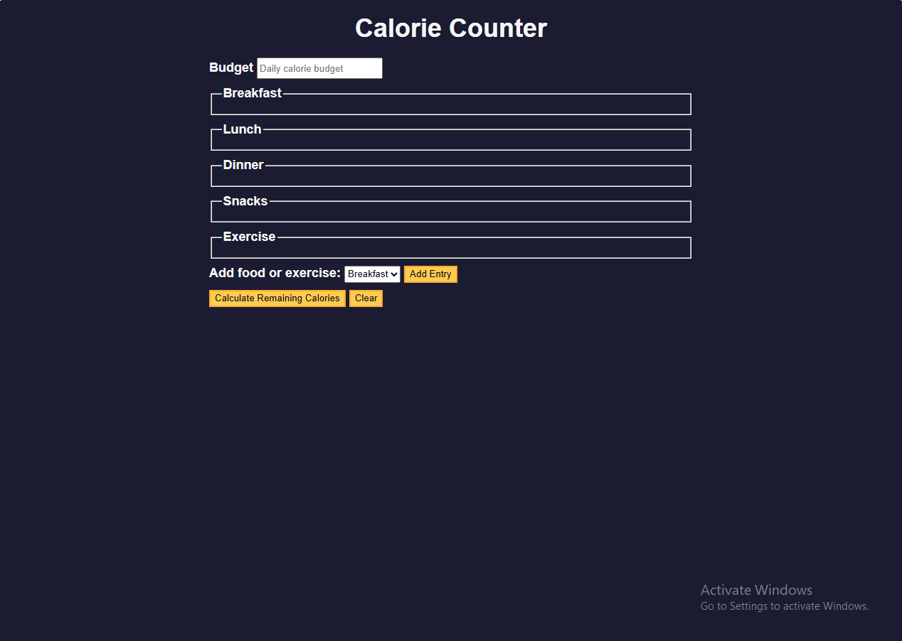

# Calorie Counter - freeCodeCamp Project

[]
[]
[]

A responsive calorie tracking web app built with vanilla JavaScript as part of freeCodeCamp's curriculum.

## ✨ Key Features

- Intuitive form interface for daily calorie tracking
- Flexible meal categories (breakfast, lunch, dinner, snacks)
- Exercise calorie deduction
- Real-time surplus/deficit calculation
- Responsive design (works on mobile & desktop)

## 🛠️ Technologies Used

- **HTML5**: Semantic structure
- **CSS3**: Flexbox & custom properties
- **Vanilla JavaScript**: DOM manipulation

## 🚀 How to Use

1. Set your daily calorie budget
2. Click "Add Entry" to log foods/meals
3. Enter exercise details (optional)
4. Hit "Calculate" to see your balance
5. Use "Clear" to start fresh

## 📸 Screenshot

## 🌐 Live Demo

[Try it online!](https://abdulrahmanfrontend.github.io/fcc-calorie-counter/)

## 🤝 Contributing

Pull requests are welcome! For major changes, please open an issue first.

## 📜 License

[MIT](https://choosealicense.com/licenses/mit/)
